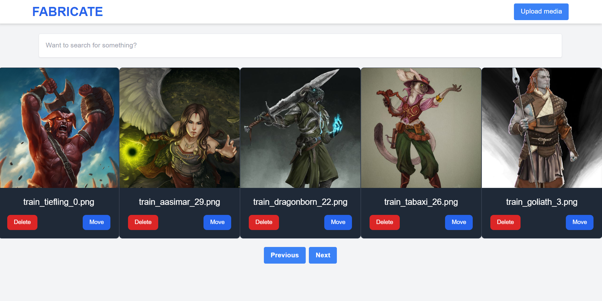

# Fabricate: AI Driver Synthetic Data Management



Fabricate is a Vue.js and FastAPI-based application focused on managing and annotating synthetic datasets for AI development. 

It streamlines the process of sorting, labeling, and manipulating images, catering to the needs of AI model training and synthetic data management.

## Functional Requirements
### Image Sorting and Labeling
- Sort Images: Sort synthetic images based on predefined criteria.
- Manual Labeling: Manually label images with tags or categories for easy identification.
### Image Operations
- Move Images: Move images to specified directories or storage areas.
- Metadata Addition: Add metadata, annotations, or descriptions to images.
- Image Deletion: Capability to delete images from the dataset.
- Image Cropping and Dimension Adjustment: Tools to crop and adjust image dimensions.
- Resolution Normalization: Normalize resolution across all images for consistency.
### Scalability and Storage
- Multiple Storage Locations: Support for local and cloud-based storage, including blob storage.
- Dynamic Configuration: Switch between or aggregate data from various storage sources.
- Large Dataset Handling: Efficient loading and rendering of large image datasets. Implements virtual scrolling or pagination for dataset navigation.
### Data Sifting and Tagging
- Efficient Navigation: Advanced search and filter options to find specific images or categories.
- Bulk Tagging: Apply labels to multiple images simultaneously.
### Data Export and Integration
- Export Functionality: Export tagged images and metadata in formats compatible with AI training platforms.
- Integration with AI Models: Compatibility with external AI models or adapters for automated tagging or analysis.
### User Interface and Experience
- Intuitive UI Design: User-friendly interface with clear instructions and visual cues.
- Responsive Design: Adapts to various screen sizes and devices.
- Accessibility and Usability: Features to accommodate diverse user needs and minimize fatigue in repetitive tasks.
### Security and Compliance
- Data Protection: Secure handling and storage of images and metadata.
### Technical and Integration Requirements
- OS Compatibility: Compatible with major operating systems for local server deployment.
- API Integration: Backend communication facilitated through a FastAPI server.
- Extensibility: Designed for future feature additions or integration with other tools and services.

### Installation and Setup
TBD : These are approximated instructions while the permanent mounting system is being developed. 

```bash
# Clone the repository
git clone https://github.com/fearnworks/fabricate

# Navigate to the project directory
cp .envtemplate .env 
cp backend/configs/config.example.yaml backend/configs/config.yaml # Update config file with your own values

docker compose up
```

### Usage
- Navigate through the image dataset using the carousel component.
- Perform CRUD operations on images.
- Connect to the backend server for real-time data synchronization.

### Configuration

Update src/api/config.js to set the API endpoints and other configurations.

